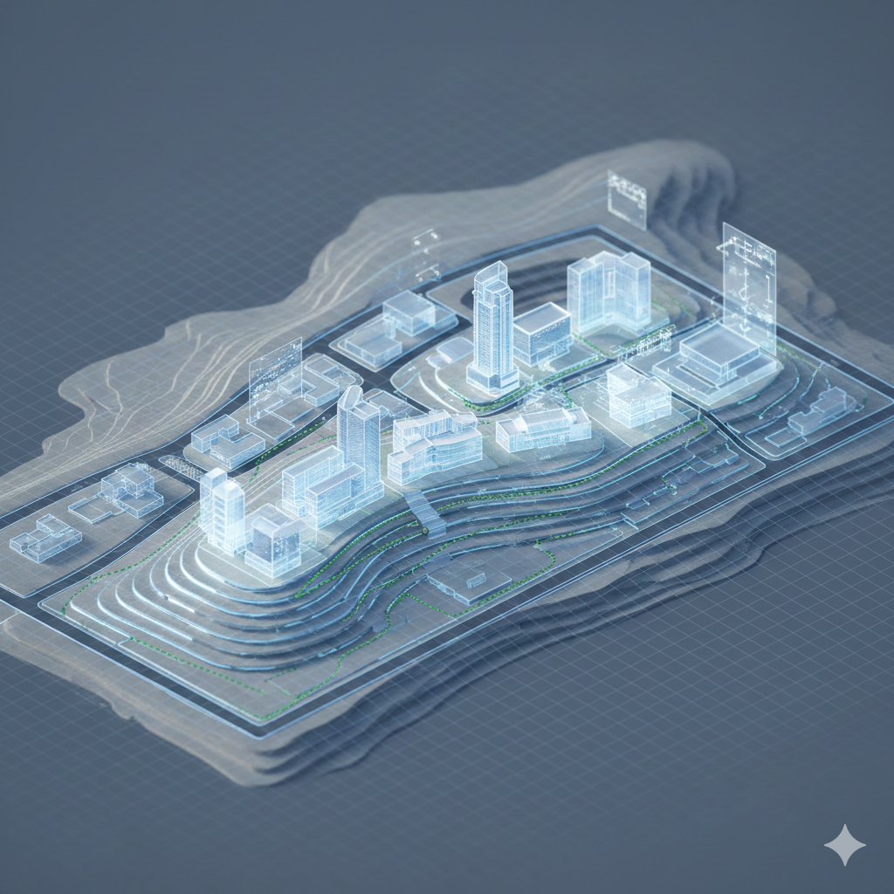

# Módulo 1 — Hello World: Tecnología como ventaja competitiva

---

## 1 Introducción 
## 1.1 Objetivo del módulo

Que los participantes comprendan por qué la tecnología dejó de ser un área de soporte y se convirtió en parte de la estrategia central del negocio educativo. Al terminar este bloque, cada líder debe poder identificar en qué nivel se encuentra su organización y qué implica esa posición para competir.

## 1.2 Pregunta guía

> ¿Por qué la tecnología dejó de ser un área de soporte y pasó a ser parte de la estrategia del negocio?

## 1.3 Dinámica Disparadora "El reemplazo Invisible"

Antes de entrar en los conceptos, arrancamos con una dinámica grupal para poner en contexto el desafío competitivo actual.

Ver guía completa: [Dinámica "El Reemplazo Invisible"](../materiales/dinamicas/01-el-reemplazo-invisible.md)

---

## 2 Conceptos clave

### 2.1 Software Is Eating The World

En 2011, Marc Andreessen publicó una tesis que sigue vigente: las empresas más valiosas del mundo no "usan" tecnología — **son** empresas de tecnología que operan en una industria específica.

En educación, esto se traduce así:

| Lo que creías | Lo que está pasando |
|---------------|---------------------|
| "Tenemos un campus virtual, estamos digitalizados" | Duolingo tiene 47M de usuarios diarios con IA adaptativa. Un Moodle con PDFs no es digitalización. |
| "Nuestra competencia son las universidades vecinas" | Tu estudiante en Buenos Aires elige entre vos, Coursera, Platzi, Google Certificates y un bootcamp en Berlín. |
| "IT es un área de soporte" | 2U compró el contenido de Harvard y MIT por USD 800M. Sin estrategia tech, está al borde de la quiebra. |
| "La IA es una moda que va a pasar" | El 81% de los empleadores ya contrata por skills, no por títulos. |
| "Invertir en tecnología es un gasto" | No invertir es una decisión de cierre en cámara lenta. |

Netflix no es una empresa de tecnología que hace entretenimiento por accidente. Entendió que la experiencia del usuario **es** el producto.

Si el negocio educativo es digital-first, entonces la arquitectura tecnológica es parte del modelo de negocio.
- No es infraestructura.
- Es estructura competitiva.

La pregunta es: ¿tu institución entiende que su experiencia tecnológica **es parte del producto educativo**?

---

### 2.2 Los tres niveles de relación con la tecnología

No todas las organizaciones se relacionan con la tecnología de la misma manera. Hay tres niveles, y la diferencia entre ellos define la capacidad competitiva.

---

#### Nivel 1 — Usar tecnología

- Comprar herramientas y usarlas tal como vienen.
- Ejemplo: adoptar Zoom para dar clases virtuales.
- Dependencia alta del proveedor.
- Sin diferenciación real.

#### Nivel 2 — Operar tecnología

- Integrar herramientas, personalizar flujos, conectar datos.
- Ejemplo: LMS + CRM para detectar riesgo de deserción.
- Genera eficiencia e inteligencia operativa.

#### Nivel 3 — Diseñar el negocio desde la tecnología

- El modelo de negocio **nace** de las capacidades tecnológicas.
- Ejemplo: Platzi diseñó su modelo de suscripción y plataforma como un sistema integrado.
- Diferenciación real y escalabilidad estructural.

> 💡 **La pregunta para cada líder: ¿en qué nivel está tu organización? ¿En qué nivel necesita estar para competir en los próximos 5 años?**

**El nivel en el que estás define el techo de tu crecimiento.**

---

### 2.3 El rol del equipo directivo en las decisiones tecnológicas

Hay decisiones tecnológicas que no son operativas. Son estratégicas.

| Decisión | Por qué es del equipo directivo |
|----------|-------------------------------|
| ¿Construimos o compramos nuestra plataforma core? | Define dependencia estructural y costos a largo plazo |
| ¿Qué datos son estratégicos y quién los gobierna? | Define capacidad de decisión basada en evidencia |
| ¿Cuánto invertimos en tecnología vs. otras áreas? | Define prioridades y visión de futuro |
| ¿Cómo integramos IA en nuestra operación? | Define posición competitiva a 3–5 años |

El directivo no necesita saber programar.
Pero sí necesita criterio tecnológico.

Y una pregunta incómoda:

> Si el CTO renuncia mañana,  
> ¿sabémos qué decisiones tecnológicas son estratégicas en mi organización y cuáles son operativas?

---

### 2.4. El mapa del sector educativo global

#### El ecosistema EdTech supera los USD 400 mil millones y se proyecta hacia el trillón hacia 2030.

Categorías estratégicas:

- **Plataformas de aprendizaje** (LMS, MOOCs)
- **Sistemas de gestión institucional** (SIS, ERP)
- **Herramientas de engagement** (CRM, comunicaciones)
- **Inteligencia artificial aplicada** (tutores, asistentes, analítica)
- **Credenciales y certificación** (badges, blockchain)

Conocer el mapa permite entender:

- Dónde competís realmente.
- Dónde hay oportunidades.
- Dónde están las amenazas invisibles.

---

#### Las tres fuerzas que están reconfigurando la educación superior

La presión no es coyuntural. Es estructural. Viene de tres fuerzas simultáneas:

---

 1️⃣ Presión financiera y sostenibilidad

- **20+ universidades cerraron en EE.UU. en 2024.** En 2025, al menos 16 más. La Reserva Federal predice que el ritmo podría subir a 80 cierres por año.
- **2U pagó USD 800M por el contenido de Harvard y MIT (edX)** y hoy enfrenta USD 900M en deuda. Tener el mejor contenido del mundo no alcanza sin modelo tecnológico sostenible.
- En LATAM, sin endowments de USD 50B como Harvard, la resiliencia financiera es menor.

La pregunta ya no es “si vamos a crecer”, sino “si el modelo actual es financieramente viable”.

---

2️⃣ Cambio en la demanda laboral

- **Google, Apple, IBM y 150+ empresas eliminaron el requisito de título universitario.**
- El **81% de los empleadores ya contrata por skills**, no por diplomas.

El valor del credential tradicional está siendo cuestionado por el mercado laboral.

---

3️⃣ Competencia nativa digital

- **Duolingo tiene 47 millones de usuarios diarios** y proyecta USD 1B en revenue para 2025.
- El mercado EdTech global es **USD 404B** y crece al 16.3% anual.
- Un estudiante en Buenos Aires compite entre universidades locales y plataformas globales.

La competencia ya no es local. Es global y tecnológica.

---
## 3 Reflexión final
Clayton Christensen predijo en 2011 que la mitad de las universidades estadounidenses cerrarían en 10–15 años. Estamos en la ventana.

**Pregunta para la sala:**  
*¿Como directivo, estas preparado para competir en este contexto? ¿O está operando con supuestos del pasado?*

---

*Siguiente: [Módulo 2 — Estrategia Tecnológica del negocio →](modulo-02-estrategia-tecnologica.md)*
