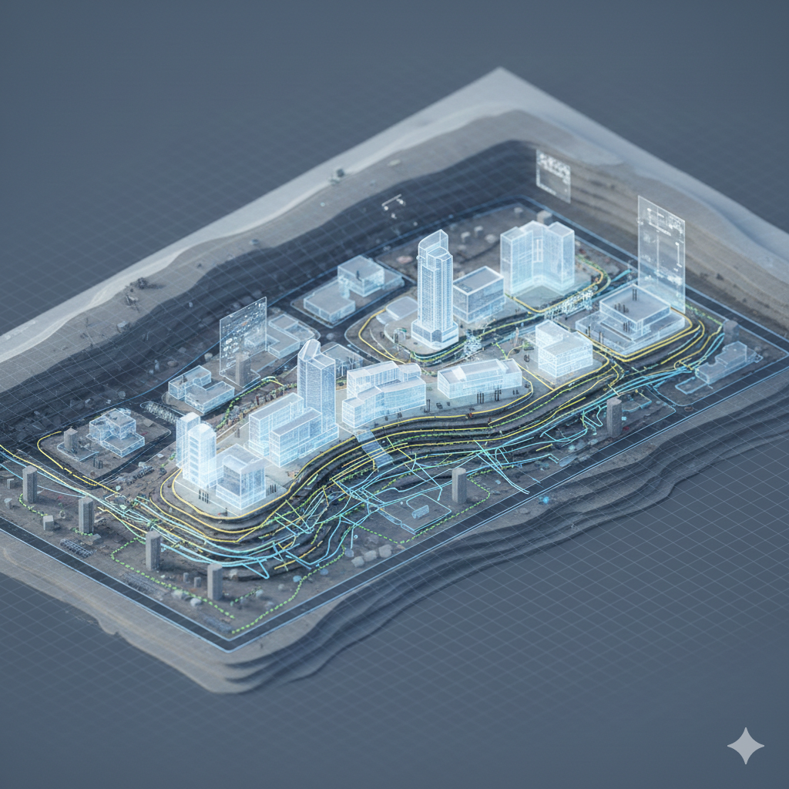

# Módulo 2 — Estrategia Tecnológica del negocio

---



## 1 Introducción

### 1.1 Objetivo del módulo

Que los participantes adquieran el vocabulario, los criterios y los frameworks necesarios para participar activamente en la definición de la estrategia tecnológica de su organización. No se trata de aprender tecnología, sino de aprender a **decidir sobre tecnología**.

### 1.2 Pregunta guía

> ¿Qué decisiones tecnológicas son estratégicas y cuáles son tácticas?

### 1.3 Dinámica Disparadora: “1 millón para invertir”

Arrancamos con un ejercicio de priorización: recibís USD 1M para invertir en la estrategia tecnológica de tu organización. ¿Cómo lo distribuís? La condición: no podés invertir en todo.

Ver guía completa: [Dinámica "1 Millón USD para invertir"](../materiales/dinamicas/02-1Million-Dollars.md)

---
## 2 Conceptos Claves

<!-- Buscar para el facilitador algunos ejemplos de decisiones tecnologicas estrategicas -->

### 2.1 Ejemplos aplicados al sector educativo (LATAM)

**El dilema de los sistemas heredados**
Muchas universidades en LATAM operan con sistemas que tienen 15-20 años. No se reemplazan porque "funcionan" — pero la realidad es que limitan el crecimiento, fragmentan los datos y generan dependencia de personas específicas. La decisión de migrar es difícil pero cada año que pasa la hace más costosa.

**El costo oculto del "gratis"**
Instituciones que adoptan herramientas gratuitas como moodle descubren tarde que no tienen control sobre los datos de sus estudiantes, no pueden personalizar la experiencia, y dependen completamente de decisiones de un tercero.

**Pregunta para la sala:**
*¿En tu experiencia, quién toma las decisiones tecnológicas estructurales? ¿El equipo directivo o el área de IT sola?*


### 2.2 Decisiones estratégicas que todo directivo debe dominar

No todas las decisiones tecnológicas son iguales. Algunas son operativas (qué herramienta de videoconferencia usar) y otras son estructurales (en qué plataforma vamos a construir nuestro futuro). Un líder debe saber distinguirlas.

#### Build vs. Buy (Construir vs. Comprar)

| | Build (Construir) | Buy (Comprar) |
|---|---|---|
| **Qué es** | Desarrollar software a medida internamente | Contratar una solución de mercado (SaaS, licencia) |
| **Ventaja** | Control total, diferenciación, propiedad de los datos | Velocidad de implementación, menor riesgo inicial |
| **Riesgo** | Costos altos, requiere equipo técnico, tiempo | Dependencia del proveedor, limitaciones de personalización |
| **Cuándo conviene** | Cuando el proceso es parte de tu ventaja competitiva | Cuando el proceso es estándar en la industria |

**Ejemplo educativo:** El SIS (Student Information System) es el corazón de una institución educativa. Universidad Siglo 21 decidió construir el suyo propio (Proyecto Algarrobo) porque ninguna solución de mercado se adaptaba a su modelo federal. Resultado: flexibilidad total para escalar a 60,000+ estudiantes.

**La regla de oro:** Comprá lo que es commodity. Construí lo que es tu ventaja competitiva.

**Impacto financiero:**

| Modelo | Tipo de gasto | Ventaja financiera | Riesgo financiero |
|--------|--------------|--------------------|--------------------|
| Build | CAPEX + OPEX (equipo permanente) | Propiedad total del activo | Inversión alta y continua |
| Buy SaaS | OPEX predecible (mensual) | Sin inversión inicial grande | Dependencia de proveedor |

Para profundizar: [Anexo: Finanzas para Decisiones Tech](../materiales/anexos/finanzas-para-decisiones-tech.md).

#### Cloud vs. On-premise

| | Cloud | On-premise |
|---|---|---|
| **Qué es** | Infraestructura alquilada (AWS, Azure, Google Cloud) | Servidores propios en tu edificio |
| **Analogía** | Alquilar un departamento: flexible, mantenimiento incluido | Comprar una casa: control total, pero vos te ocupás de todo |
| **Ventaja** | Escalabilidad, sin inversión inicial grande, actualizaciones automáticas | Control total, costos predecibles a largo plazo |
| **Riesgo** | Costos que pueden crecer, dependencia del proveedor | Obsolescencia, necesidad de equipo de infraestructura |
| **Tendencia** | La mayoría de las organizaciones están migrando a cloud | Se mantiene para regulaciones específicas |

#### Caso: Tecnológico de Monterrey — Resiliencia cloud en pandemia

- **Contexto:** Durante la pandemia, la demanda de clases virtuales se multiplicó por 10 en semanas.
- **Decisión:** Las instituciones en cloud (como el Tec de Monterrey con Azure) pudieron escalar de forma elástica.
- **Resultado:** Las que dependían de servidores on-premise colapsaron. Las que operaban en cloud escalaron sin comprar un solo servidor.
- **Lección:** La infraestructura cloud no es un lujo — es resiliencia operativa.

**Impacto financiero:** Cloud convierte CAPEX en OPEX. El CFO necesita entender esta transición porque cambia cómo se planifica y aprueba el presupuesto tecnológico.

#### Core vs. Commodity

No todos los sistemas tienen el mismo valor estratégico:

- **Core:** sistemas que definen tu ventaja competitiva. Si los perdés, perdés diferenciación.
  - Ejemplo: tu plataforma de aprendizaje personalizado, tu motor de analítica de retención.
- **Commodity:** sistemas que necesitás pero que no te diferencian. Cualquier proveedor los resuelve.
  - Ejemplo: email, herramienta de videoconferencia, sistema contable.

**La trampa común:** invertir tiempo y recursos en personalizar commodities (crear tu propio sistema de email interno) y al mismo tiempo usar soluciones genéricas para lo que es core (un LMS sin personalización).

#### Velocidad vs. Control

| Priorizar velocidad | Priorizar control |
|---|---|
| Lanzar rápido, iterar después | Planificar en detalle, lanzar cuando esté listo |
| Aceptar deuda técnica a corto plazo | Minimizar deuda técnica desde el inicio |
| Funciona para validar hipótesis | Funciona para sistemas críticos |
| Riesgo: acumulación de problemas | Riesgo: nunca lanzar, parálisis por análisis |

**La clave para líderes:** no hay una respuesta correcta universal. La decisión depende del momento de la organización, el riesgo del proyecto y la reversibilidad de la decisión.

### 2.3 Las 6 dimensiones de una estrategia tecnológica

Una estrategia tecnológica no es una lista de herramientas. Es un modelo que conecta seis dimensiones. Estas mismas dimensiones son las que vas a evaluar en el [Radar de Estrategia Tecnológica](../materiales/templates/template-radar-estrategia-tech.md).

#### Infraestructura

- ¿Dónde viven tus sistemas y datos? ¿Cloud, on-premise, o híbrido?
- ¿Tu infraestructura puede escalar en picos (inscripciones, exámenes)?
- ¿Cuán dependiente sos de servidores físicos o de un proveedor cloud?

#### Arquitectura

- ¿Cómo están organizados tus sistemas? ¿Se hablan entre sí o son islas?
- ¿La información fluye automáticamente o requiere carga manual?
- ¿Cuántos procesos dependen de un Excel o un email para funcionar?

#### Datos
- ¿Qué datos tenemos? ¿Son confiables?
- ¿Quién los gobierna? ¿Están centralizados o fragmentados?
- ¿Tomamos decisiones basadas en datos o en intuición?

---
> 💡 **Politica de Gobernanza de Datos Grupo R'Evolution.**
>  Propiedad Institucional y Custodia Ejecutiva :  El CTO es el custodio de la Arquitectura de Datos , y de sus accesos. El CEO es el responsable final del cumplimiento.
---

#### Seguridad
- ¿Tenemos políticas de seguridad definidas?
- ¿Quién tiene acceso a qué? ¿Lo sabemos?
- ¿Estamos preparados para un incidente (fuga de datos, ransomware)?

#### Talento
- ¿Tenemos las personas correctas para ejecutar la estrategia?
- ¿Nuestro equipo de IT es de "apaga incendios" o de construcción estratégica?
- ¿El negocio y la tecnología hablan el mismo idioma?

#### Innovación

- ¿Cómo incorporamos nuevas tecnologías? ¿Hay un proceso o es ad hoc?
- ¿Quién identifica oportunidades tecnológicas? ¿Solo IT o también el negocio?
- ¿Tenemos espacio para experimentar o toda inversión requiere un business case completo?

### 2.4 Alineación tecnología-negocio

La estrategia tecnológica no existe en el vacío. Debe estar alineada con:

- **El modelo de negocio:** ¿Cómo genera valor la organización? ¿Qué rol juega la tecnología en esa generación de valor?
- **La etapa de crecimiento:** Una startup EdTech necesita velocidad. Una universidad establecida necesita estabilidad y migración gradual.
- **Los objetivos a 3-5 años:** ¿Queremos crecer en matrícula? ¿Expandir a nuevos mercados? ¿Mejorar retención? La respuesta define las prioridades tecnológicas.

**Framework de alineación:**

```
Objetivos de negocio → Capacidades necesarias → Habilitadores tecnológicos → Inversión y priorización
```

Ejemplo:
- Objetivo: reducir deserción del 42% al 25% en 2 años.
- Capacidad: detectar estudiantes en riesgo antes de que abandonen.
- Habilitador: analítica predictiva conectada al LMS y al SIS.
- Inversión: integración de datos + modelo de alertas + equipo de intervención.

> Para profundizar en frameworks estratégicos (Wardley Maps, Hype Cycle, TOGAF simplificado), ver el [Anexo: Frameworks Estratégicos](../materiales/anexos/frameworks-estrategicos.md).


---


## 3 Reflexión final

> No existen decisiones "puramente tecnológicas".
> Toda decisión tecnológica es una decisión de negocio con consecuencias en costos, velocidad, dependencia y diferenciación.
>
> El directivo que no participa en estas decisiones no está delegando — está abdicando.

> Cada decisión tecnológica que tomás (o que dejás que otros tomen por vos)
> define la estructura de costos, la velocidad y la dependencia de tu organización por los próximos 3-5 años.
> ¿Estás eligiendo… o estás heredando?

---

## 4 Resultado esperado

Al finalizar este módulo, el participante puede:

- Distinguir decisiones tecnológicas estratégicas de las tácticas.
- Aplicar los criterios Build vs. Buy, Cloud vs. On-premise, Core vs. Commodity y Velocidad vs. Control.
- Evaluar las 6 dimensiones de una estrategia tecnológica en su propia organización.
- Articular la alineación entre objetivos de negocio y habilitadores tecnológicos.
- Entender el impacto financiero (CAPEX vs. OPEX) de las decisiones tecnológicas.

---

*Anterior: [← Módulo 1 — Hello World](modulo-01-hello-world.md)*
*Siguiente: [Módulo 3 — Arquitectura IT Educativa →](modulo-03-arquitectura-it.md)*
