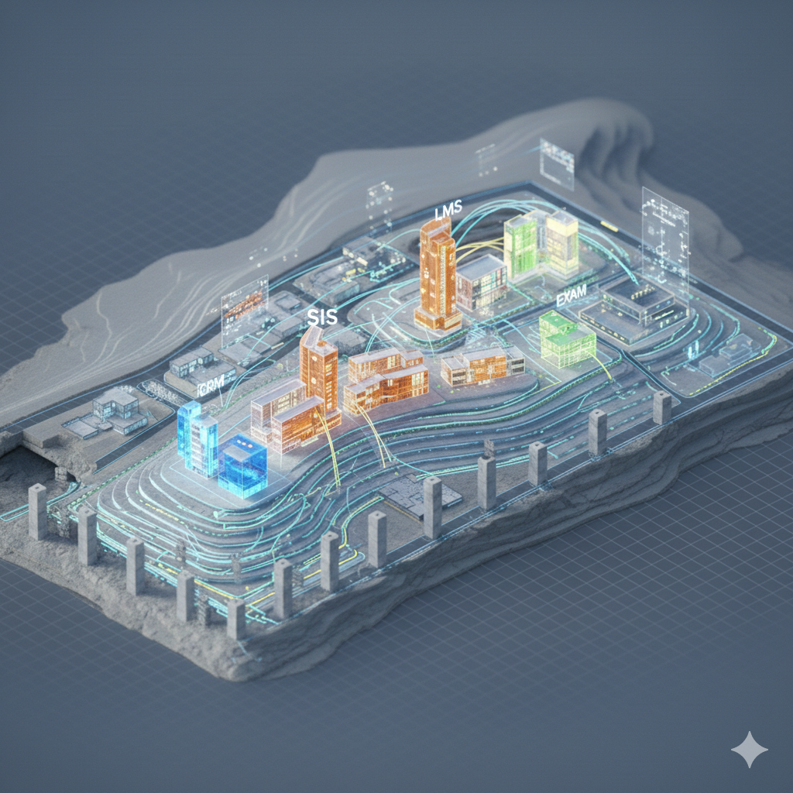

# Módulo 3 — Arquitectura IT Educativa

---



---
## 1 Introducción

### 1.1 Objetivo del módulo
Que los participantes puedan **leer, cuestionar y discutir** la arquitectura tecnológica de una organización, aunque no sean técnicos. No se trata de aprender a diseñar sistemas, sino de entender cómo funcionan por dentro para tomar mejores decisiones y hacer mejores preguntas.

La arquitectura IT no es un tema de infraestructura. Es un tema de gobierno, competitividad y riesgo estratégico.

---

### 1.2 Pregunta guía

> ¿Cómo funciona realmente una institución educativa moderna por dentro?

---

### 1.3 Dinámica Disparadora "Tu Stack en una servilleta" 

Arrancamos con un ejercicio rápido: cada participante dibuja en una servilleta (o una hoja) todos los sistemas tecnológicos que conoce de su organización y cómo se conectan. El objetivo es hacer visible lo que normalmente es invisible.

## Dinámica: "Tu stack en una servilleta"

**Duración:** 15 minutos

### Instrucciones

1. Dibujá todas las herramientas tecnológicas que vos conoces. 
2. Nombralas y conectalas si están integradas.
3. Marcá las críticas.
4. Señalá las que no entendés cómo se conectan.
5. Dibuja como sea. No hay reglas. 

---

### Debrief


- ¿Cuántas herramientas aparecieron?
- ¿Se puede o es facil cambiar?
- ¿Cuántas están realmente integradas?
- ¿Quién tiene la visión completa?
- ¿Tu stack permite cambiar el modelo de negocio?

La complejidad tecnológica que no se ve es una de las mayores fuentes de riesgo estratégico. 

---

## 2 Conceptos claves

### 2.1 ¿Qué es una arquitectura IT?

Una arquitectura IT es el **mapa** de todos los sistemas tecnológicos de una organización: qué sistemas existen, qué hace cada uno, cómo se conectan entre sí y cómo fluye la información.


**Analogía:** pensá en tu organización como el campus.
- Los "sistemas" son los espacios o edificios (cada uno cumple una función especifica). Biblioteca, Bedelia, Administracion, Rectoria, etc. 
- Las integraciones son los pasillos (conectan los edificios entre sí). E.g. no cumplen ninguna funcion mas que llevar datos de un lugar a otro.
- Los datos son las personas que circulan por el campus (si los pasillos están cortadas, no llegan a destino).
- La arquitectura IT es el plano de la campus completo.

Un directivo no necesita saber construir edificios. Pero sí necesita poder leer el plano de la ciudad para decidir dónde construir el próximo, cuál demoler y cuál renovar.

**¿Por qué importa entender la arquitectura?**

Porque las decisiones de arquitectura tienen consecuencias que se extienden por años. Una institución que elige un SIS sin pensar en integraciones va a pagar ese error durante una década. Una que construye sus sistemas como islas va a necesitar personas que "traducen" entre sistemas — generando cuellos de botella, errores y dependencias de individuos específicos.

La arquitectura no solo determina cómo funciona la tecnología. Determina qué es posible hacer como organización.

> **¿Qué es un "sistema"?** En este contexto, un sistema es una pieza de software que cumple una función específica dentro de la organización: gestionar estudiantes, procesar pagos, entregar contenido, etc. Cada sistema tiene sus propios datos, sus propias reglas y sus propios usuarios. La arquitectura IT es cómo esos sistemas se organizan y se comunican entre sí.

---

### 2.2 Los sistemas clave de una organización educativa

Toda organización educativa moderna opera con un ecosistema de sistemas. Los principales son:

| Sistema | Qué hace | Espacio del campus |
|---------|----------|--------------------|
| **CMS** (Content Management System) | Presenta la Institución en la web, publica la oferta académica y puede contener el e-commerce | La **fachada y cartelería** del campus — lo primero que ve el visitante |
| **SIS** (Student Information System) | Gestiona toda la vida académica del estudiante: inscripción, cursada, notas, título | El **rectorado** — donde vive el legajo oficial de cada estudiante |
| **LMS** (Learning Management System) | Plataforma donde se da la experiencia de aprendizaje: contenidos, actividades, foros | Las **aulas** — donde ocurre el aprendizaje |
| **EXAM** (Exam & Proctoring) | Plataforma de examinación segura, con auditorías de fraude | El **salón de exámenes** — acceso controlado y supervisado |
| **CRM** (Customer Relationship Management) | Gestiona la relación con prospectos y estudiantes: campañas, seguimiento, comunicación | La **bedelía / oficina de atención** — el punto de contacto con el estudiante |
| **ERP** (Enterprise Resource Planning) | Gestiona administración y finanzas: facturación, pagos, contabilidad, RRHH | La **oficina de administración** — donde se gestionan los recursos del campus |
| **BI** (Business Intelligence) | Analítica y reportes: dashboards, indicadores, tendencias | La **sala de dirección** — donde se miran los números y se toman decisiones |
| **IA** (Inteligencia Artificial) | Capa transversal: chatbots, analítica predictiva, personalización | El **asistente inteligente** — presente en todos los espacios, mejorando cada interacción |

#### 2.3  Un zoom sobre el SIS: el sistema más estratégico


El "Student Information System" es el sistema Core: modela la estrategia académica y los procesos académicos más importantes.


El Student Information System (SIS) merece atención especial porque es el **sistema de registro oficial** de la institución. No es una herramienta de soporte — es el núcleo del modelo académico.

Un SIS bien implementado:
- Reduce errores en la gestión de matrículas y calificaciones
- Permite automatizar flujos administrativos (inscripciones, actas, diplomas)
- Habilita la toma de decisiones basada en datos reales del estudiante
- Es la fuente de verdad que alimenta al LMS, CRM, ERP y BI

Un SIS mal implementado (o ausente) se convierte en un laberinto de Excel, correos y trámites manuales que escala de forma lineal: más estudiantes = más personas procesando datos. No hay crecimiento sostenible sin un SIS sólido.


#### 2.4 ¿Qué pasa con el LMS?

El LMS (Learning Management System) es la cara visible de la institución para el estudiante. Sin embargo, muchas instituciones cometen el error de tratar el LMS como un repositorio de PDFs y videos — cuando su verdadero valor está en los **datos de aprendizaje** que genera.

Las tres funciones principales de un LMS son:

**1. Contenido y diseño instruccional:** El LMS organiza el material de aprendizaje (videos, lecturas, actividades) en una secuencia pedagógica con sentido. No es un repositorio de archivos — es la estructura que guía al estudiante a través de una experiencia de aprendizaje diseñada intencionalmente.

**2. Cátedras y aulas virtuales:** Cada curso o sección tiene su espacio donde interactúan docentes y estudiantes: foros, entregas, comunicaciones, calendario. Es el equivalente digital del aula física, pero con la ventaja de que todo queda registrado.

**3. Gradebook (libro de calificaciones):** Registro centralizado de evaluaciones, notas parciales y finales. Cuando está integrado con el SIS, las calificaciones fluyen automáticamente al expediente oficial del estudiante sin intervención manual.

#### Caso: Purdue University — Course Signals

- **Contexto:** Universidad con alta deserción necesitaba detectar estudiantes en riesgo de forma temprana.
- **Decisión:** Usar datos del LMS (participación, entregas, tiempo en plataforma) para alimentar un sistema de alertas tempranas ("Course Signals").
- **Resultado:** Mejora del 21% en retención de estudiantes en riesgo. El valor no estaba en el LMS como repositorio de contenido, sino en los datos de comportamiento que generaba.

---

### 2.5 El CRM

En el contexto educativo, el CRM gestiona toda la relación con el estudiante desde antes de que se inscriba hasta después de que se gradúe. Sus tres funciones principales son:

**Marketing:** Captación de prospectos a través de campañas digitales, landing pages, eventos y redes sociales. El CRM rastrea de dónde viene cada prospecto, qué programa le interesa y en qué etapa del proceso de decisión se encuentra. Permite medir el costo de adquisición por estudiante y la efectividad de cada canal.

**Sales (Admisiones):** Gestión del embudo de conversión desde el primer contacto hasta la inscripción. Los asesores de admisión usan el CRM para hacer seguimiento personalizado, agendar llamadas, enviar información y no perder prospectos por falta de seguimiento. Sin CRM, los prospectos se pierden en bandejas de email y planillas.

**Servicio (Atención al estudiante):** Una vez inscripto, el estudiante necesita soporte: consultas administrativas, reclamos, trámites, solicitudes. El CRM centraliza estos casos para que cualquier persona del equipo pueda ver el historial completo del estudiante y responder con contexto, sin que el estudiante tenga que repetir su situación cada vez.

#### Caso: Georgia State University — Reducir el "summer melt"

- **Contexto:** Muchos estudiantes aceptados nunca completaban la inscripción (fenómeno conocido como "summer melt").
- **Decisión:** Usar el CRM para automatizar seguimiento proactivo con mensajes personalizados durante el verano previo al ingreso.
- **Resultado:** Reducción del 22% en el summer melt. La clave fue que el CRM tenía los datos del proceso de admisión y podía intervenir en el momento justo.

### 2.6 El ciclo de vida del estudiante visto desde los sistemas

La experiencia del estudiante es un viaje que atraviesa múltiples sistemas. Cada etapa depende de que los sistemas correctos funcionen y estén conectados:

```
Captación → Consideracion → Admisión → Onboarding → Cursada → Servicios al Est → Evaluación → Graduación → Alumni
 CRM/Mktg     CMS/Web      SIS        SIS/LMS      LMS       CRM/Services        EXAM        SIS         CRM
```


### 2.7 Cuadrante de Tecnología en Modelo MII

El modelo MII, en su cuadrante de Tecnología define la línea base de stack tecnológico para el grupo R'Evolution, como la arquitectura recomendada y deseada en cada institución, para garantizar la calidad y excelencia en la experiencia del estudiante, y la escalabilidad y eficiencia en su modelo académico mediado por tecnología.

¿Por qué es importante definir una línea base tecnológica común para todas las instituciones del grupo? Porque sin ella, cada institución reinventa la rueda: elige sus propias herramientas, desarrolla sus propios procesos y forma a su equipo desde cero. Una línea base compartida genera **coherencia** en la experiencia del estudiante sin importar la sede, **reutilización del know-how** (lo que aprende una institución al implementar el LMS beneficia a todas), **negociación en escala** con proveedores (mejores precios y condiciones), y **movilidad del talento técnico** entre instituciones sin curva de aprendizaje. No se trata de uniformar — se trata de construir sobre una base común que permita a cada institución diferenciarse donde realmente importa.


---

### 2.8 Integraciones: el sistema nervioso de la organización

**Los problemas reales surgen en las transiciones:**
- El prospecto que se inscribe en el CRM pero sus datos no llegan al SIS → tiene que cargar todo de nuevo.
- El estudiante que aprueba en el LMS pero la nota no se refleja en el SIS → necesita un trámite manual.
- El graduado que no recibe seguimiento porque el CRM no tiene datos de ex-alumnos → oportunidad perdida.

Cada una de estas transiciones que falla tiene un nombre en el negocio: **fricción**. Y la fricción tiene costos directos (tiempo operativo, errores, reclamos) e indirectos (NPS, deserción, reputación).

Un estudio de Salesforce encontró que el 76% de los clientes espera interacciones consistentes entre áreas. En educación, el equivalente es que el asesor académico, el sistema de pagos y la plataforma de aprendizaje "conozcan" al mismo estudiante. Cuando no es así, el estudiante lo nota — y eventualmente se va.


Los sistemas individuales son importantes, pero lo que realmente define la madurez de una arquitectura es **cómo se conectan entre sí**.

**Cada quiebre en la integración es una mala experiencia para el estudiante y un costo operativo para la organización.**

Hay cuatro niveles de integración, y cada salto hacia arriba representa un cambio cualitativo — no solo de velocidad, sino de qué es posible hacer:

| Nivel | Cómo funciona | Ejemplo | Limitación |
|-------|--------------|---------|------------|
| **Manual** | Alguien exporta un Excel y lo importa en otro sistema | Pasar notas del LMS al SIS a mano | Errores humanos, lentitud, escala lineal |
| **Archivos** | Un sistema genera un archivo que otro consume automáticamente | CSV de inscriptos que se importa cada noche | Datos desactualizados, sin tiempo real |
| **APIs** | Los sistemas se hablan en tiempo real | Cuando un estudiante se inscribe en el SIS, automáticamente se crea su cuenta en el LMS | Requiere desarrollo técnico, documentación |
| **Eventos** | Los sistemas reaccionan a lo que pasa en otros sistemas | Cuando un estudiante no ingresa al LMS en 7 días, el CRM genera una alerta automática | Mayor complejidad arquitectural |

**¿Qué significa pasar de manual a APIs en la práctica?**

Una institución con 10.000 estudiantes que procesa notas manualmente necesita aproximadamente 3 personas trabajando a tiempo parcial en ese proceso. Con integración por APIs, ese proceso es instantáneo y libre de errores. El ahorro no es solo de tiempo: es de riesgo. Los errores en datos académicos tienen consecuencias legales y reputacionales.

Pero la integración no es solo un tema técnico. **Es un tema de gobierno.** Alguien tiene que decidir quién es el "dueño" de cada dato, qué sistema es la fuente de verdad, y qué pasa cuando dos sistemas tienen información contradictoria sobre el mismo estudiante.

### 2.9 El concepto de "fuente de verdad única" (Single Source of Truth)

Una de las causas más comunes de caos en organizaciones educativas es tener el mismo dato en múltiples sistemas — y que esos datos no coincidan.

¿La fecha de nacimiento del estudiante está en el SIS, en el CRM o en ambos? ¿Cuál es la correcta si difieren? ¿Qué pasa si el estudiante cambia su email en uno pero no en el otro?

La arquitectura madura define para cada dato cuál es el sistema maestro (la fuente de verdad) y cómo se propaga esa información al resto de los sistemas. Sin esa definición, cada área trabaja con su propia "versión de la verdad" — y las decisiones se toman sobre datos inconsistentes.

**Ejemplo de lo que pasa sin SSOT:** Una institución reporta 12,000 estudiantes activos según el SIS, pero 14,200 según el CRM y 10,800 según el LMS. ¿Cuántos estudiantes tiene realmente? Nadie sabe. El equipo de marketing invierte basándose en un número, finanzas presupuesta con otro, y el rector presenta un tercero al directorio. Tres decisiones estratégicas tomadas sobre tres datos distintos del mismo concepto.

**Para el líder ejecutivo, las preguntas clave son:**
- ¿Cuántos procesos dependen de carga manual? (Cada uno es un riesgo y un costo)
- ¿Los datos del estudiante están en un solo lugar o fragmentados en 5 sistemas?
- ¿Cuánto tiempo pasa entre que algo sucede y se refleja en todos los sistemas?
- ¿Si mañana un estudiante llama preguntando por su situación, cuántos sistemas hay que consultar?

---

### 2.10 La arquitectura como herramienta de decisión

Una arquitectura IT bien entendida permite al líder evaluar y anticipar problemas antes de que se conviertan en crisis.

**Escalabilidad:** ¿puede mi infraestructura soportar el doble de estudiantes? ¿O necesito cambiar sistemas antes de crecer?

Muchas instituciones descubren sus limitaciones de arquitectura en el peor momento posible: durante un período de inscripción récord, en el que el sistema se cae bajo la carga, o cuando una fusión con otra institución revela que los sistemas son incompatibles. La arquitectura pensada con anticipación convierte el crecimiento en una oportunidad en lugar de una crisis.

**Gobierno:** ¿quién es el "dueño" de cada dato? ¿Quién decide qué sistema se reemplaza? ¿Hay una visión unificada o cada área compra lo que necesita?

El "shadow IT" — sistemas comprados por áreas sin coordinación con IT — es uno de los riesgos más subestimados en organizaciones educativas. Marketing compra su herramienta de email. Académico compra su plataforma de contenidos. Finanzas su sistema de pagos. El resultado: 15 sistemas, 3 integrados, datos en silos y nadie con la visión completa.

**Costos:** ¿cuánto cuesta mantener sistemas que no se integran? ¿Cuántas horas-persona se pierden en procesos manuales que podrían automatizarse?

McKinsey estima que la deuda técnica consume en promedio el 40% del presupuesto de IT en empresas medianas. En educación, esa deuda se manifiesta en sistemas legacy que "nadie quiere tocar" porque hay un solo técnico que los entiende, en procesos manuales que consumen horas que podrían ir a innovación, y en la incapacidad de responder rápidamente a cambios del mercado.

**Riesgo:** ¿qué pasa si cae el sistema central? ¿Hay plan B? ¿Los datos están respaldados?

La continuidad operativa es una conversación que muchos equipos directivos evitan porque implica invertir en algo que "puede que nunca se necesite". Hasta que se necesita. Un ransomware que cifra los datos de 50.000 estudiantes, un data center que pierde energía durante un período de exámenes, una actualización mal ejecutada que corrompe la base de datos de matrículas — son escenarios que ocurren, y que sin un plan de recuperación pueden convertirse en crisis institucionales.

---

## Dinámica: "Revisar la servilleta"

**Duración:** 10 minutos

**Debrief facilitador:**
- Buscar patrones comunes entre las organizaciones.
- Señalar que mapear la arquitectura es un acto de gobierno, no un ejercicio técnico.
- Destacar que muchos líderes hacen este ejercicio por primera vez — y eso es parte del problema.


---

## Reflexión final

> La arquitectura IT de tu institución es como el sistema circulatorio de una persona.
> Cuando funciona bien, no lo notás.
> Cuando falla, todo se detiene.
> ¿Sabés cómo está el tuyo?

---

## Referencias y lecturas recomendadas

### Frameworks y metodologías
- **TOGAF (The Open Group Architecture Framework):** El framework más utilizado para diseñar arquitecturas IT empresariales. Su versión simplificada es una excelente referencia para líderes no técnicos. [opengroup.org/togaf](https://www.opengroup.org/togaf)
- **Wardley Maps:** Metodología para visualizar el estado de una arquitectura tecnológica y su evolución estratégica. Creada por Simon Wardley. [learnwardleymapping.com](https://learnwardleymapping.com)

### Sistemas educativos (SIS / LMS)
- **Ellucian:** El proveedor de SIS más grande del mercado para educación superior. Sus reportes anuales sobre tendencias tecnológicas en educación son una referencia clave. [ellucian.com](https://www.ellucian.com)
- **Instructure (Canvas):** Uno de los LMS líderes globales. Sus estudios sobre engagement estudiantil y uso de datos de aprendizaje son valiosos. [instructure.com](https://www.instructure.com)
- **Moodle:** La plataforma LMS open source más utilizada en LATAM. [moodle.org](https://moodle.org)

### Integraciones y arquitectura de datos
- **"Designing Data-Intensive Applications" — Martin Kleppmann (2017):** El libro de referencia sobre cómo construir sistemas que manejan datos a escala. Técnico pero accesible para líderes con curiosidad.
- **APIs and the Modern EdTech Stack — EDUCAUSE:** Reportes sobre cómo las instituciones están modernizando su arquitectura con APIs. [educause.edu](https://www.educause.edu)

### Casos de estudio
- **Salesforce Research — "State of the Connected Customer":** Estadísticas sobre expectativas de los clientes en experiencias conectadas, aplicables directamente a la experiencia del estudiante. [salesforce.com/research](https://www.salesforce.com/research)
- **McKinsey — "Curing the Addiction to Growth":** Análisis sobre deuda técnica y su impacto en organizaciones. [mckinsey.com/capabilities/mckinsey-digital](https://www.mckinsey.com/capabilities/mckinsey-digital/our-insights)

### Gobernanza de datos en educación
- **FERPA (Family Educational Rights and Privacy Act):** El marco regulatorio de EE.UU. para privacidad de datos educativos, referencia global. [studentprivacy.ed.gov](https://studentprivacy.ed.gov)
- **IMS Global Learning Consortium:** Estándares de interoperabilidad para sistemas educativos (APIs, formatos de datos). [imsglobal.org](https://www.imsglobal.org)

---

*Anterior: [← Módulo 2 — Estrategia Tecnológica](../modulo-02/modulo-02-estrategia-tecnologica.md)*
*Siguiente: [Módulo 4 — Transformación Digital e IA →](../modulo-04/modulo-04-transformacion-digital-ia.md)*
