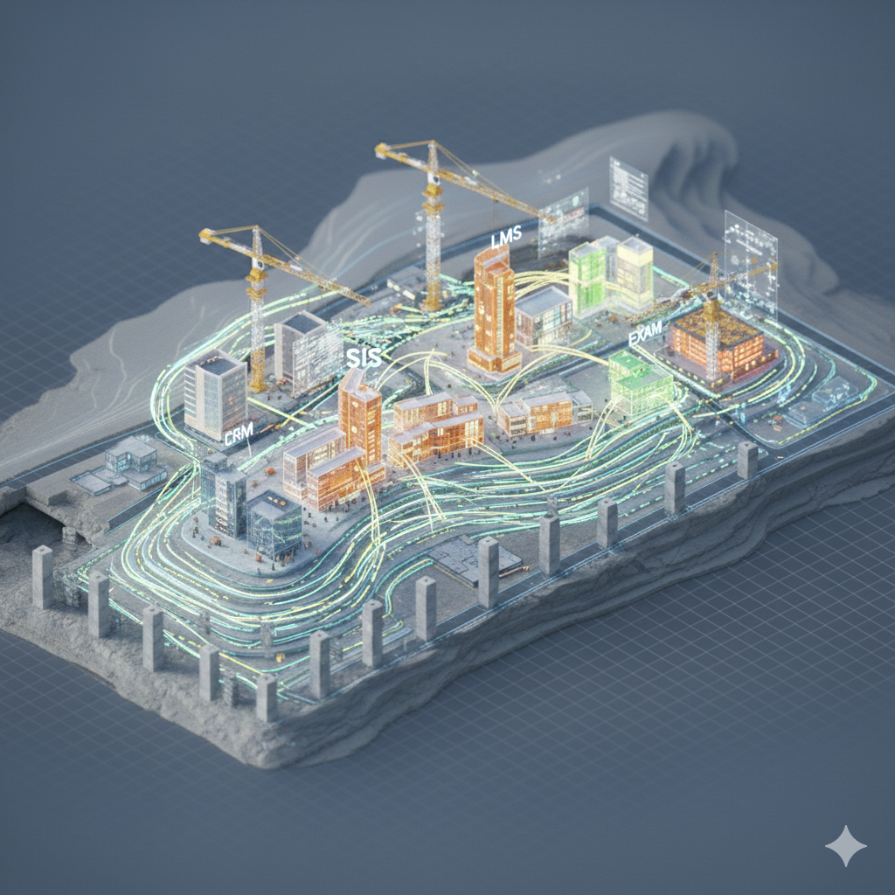

# Módulo 4 — Transformación Digital e IA  
---


## 1 Introducción

### 1.1 Objetivo del módulo

Que los participantes:

- Comprendan que la transformación digital requiere **cultura + procesos + tecnología**.
- Entiendan que la adopción de IA no es un proyecto aislado, sino una **decisión estratégica con gobernanza**.
- Conozcan el **framework real de aplicación de IA**.
- Salgan con un **primer paso concreto y estructurado** para avanzar.

---

### 1.2 Pregunta guía

> ¿Cómo transformar sin romper la organización?

### 1.3 Dinámica Disparadora: 🔥 90 Días para No Colapsar

- En esta simulación individual, cada participante enfrenta 10 decisiones estratégicas bajo presión, representando una organización en crisis.  
- En cada escenario deberá elegir entre priorizar **Tecnología, Proceso o Cultura**, sin conocer el impacto acumulado.

- Al finalizar, se revela su perfil estratégico y el equilibrio (o desbalance) de su triángulo Cultura–Proceso–Tecnología.  
- En pantalla principal, veremos el mapa colectivo del grupo en tiempo real.

El objetivo no es acertar.  
Es descubrir cómo decidimos cuando el sistema está bajo tensión.

https://ninety-day-strategy-spark.lovable.app

## Resumen dinamica

- Toda decisión fortalece un vértice del triángulo y puede debilitar otro si no se equilibra.
- El problema no es una mala decisión aislada, sino el patrón acumulado de decisiones.
- Cada líder tiende a sobrerrepresentar su zona cómoda (Tecnología, Proceso o Cultura).
- El desbalance sistémico no se ve al inicio, pero termina generando fricción estructural.
- La resiliencia organizacional surge del equilibrio coherente entre Cultura, Proceso y Tecnología.


---

## 2. Conceptos Clave

### 2.1 El Triángulo de la Transformación Digital

La transformación digital **no es un proyecto de tecnología**.

McKinsey la define como **un cambio fundamental en cómo una organización crea y entrega valor**, habilitado por tecnología pero no determinado por ella. No se trata de digitalizar lo que ya existe — se trata de reimaginar cómo opera el negocio.

Su investigación sobre más de 900 empresas en transformación identificó algo claro: las organizaciones que tratan la transformación como un proyecto de IT fracasan. Las que la tratan como un cambio de modelo de negocio, con tecnología como habilitador, tienen 2,5 veces más probabilidad de éxito.

Es la intersección de tres dimensiones:

```text
          Cultura
         /       \
        /         \
       /           \
  Procesos ------- Tecnología
```

| Dimensión | Qué implica | Sin ella… |
|------------|------------|------------|
| Cultura | Liderazgo visible, apertura al cambio | La tecnología no se usa |
| Procesos | Rediseño real del trabajo | Se automatiza lo ineficiente |
| Tecnología | Arquitectura, integración, escalabilidad | La estrategia no se ejecuta |


### 2.2 El modelo holístico de McKinsey: las 6 dimensiones

McKinsey evolucionó su concepto y hoy habla de **transformación holística** — porque descubrieron que las organizaciones que se enfocaban en una sola dimensión (solo tecnología, solo cultura, solo procesos) invariablemente fracasaban. El cambio necesita ser sistémico.

Las 6 dimensiones obligatorias para una transformación exitosa:

| Dimensión | Qué implica |
| --------- | ----------- |
| **Estrategia y modelo de negocio** | Redefinir dónde y cómo compite la organización en el mundo digital |
| **Agilidad y organización** | Equipos pequeños, autónomos, con mandato claro y capacidad de decidir rápido |
| **Tecnología** | Arquitectura moderna, datos integrados, capacidad de iterar sin romper todo |
| **Datos y analítica** | Los datos como activo estratégico, no como subproducto de la operación |
| **Talento y cultura** | Líderes que modelan el cambio, equipos con nuevas capacidades, una cultura que aprende |
| **Ecosistema** | Partnerships, plataformas y terceros que amplían capacidades sin construir todo internamente |

El término "holístico" no es marketing — es una advertencia: si falta una dimensión, el sistema colapsa. Una organización con excelente tecnología y cultura resistente al cambio es como un auto de Fórmula 1 conducido por alguien sin licencia.

#### Caso: BBVA — La transformación cultural imposible

- **Contexto:** Banco con 160 años de historia necesitaba competir con fintech. Transformar la cultura interna era más difícil que construir la tecnología.
- **Decisión:** Crear una unidad digital completamente separada — nueva oficina, nuevo equipo contratado desde afuera, nuevos procesos, nueva cultura.
- **Resultado:** La unidad demostró resultados primero y luego empezó a influir en el banco tradicional.
- **Lección para educación:** A veces la transformación no se logra cambiando lo que existe, sino construyendo algo nuevo al lado y dejando que el éxito hable por sí mismo.

---

### 2.3 Anti-patrones frecuentes

Según el reporte [*"The new digital edge"* de McKinsey (2023)](https://www.mckinsey.com/capabilities/mckinsey-digital/our-insights/the-new-digital-edge), **el 70% de las transformaciones digitales no alcanzan sus objetivos**. Gartner coincide: menos de 1 de cada 3 proyectos de transformación entrega el valor prometido.


¿Por qué fallan?

| Causa de fracaso | Frecuencia |
| ---------------- | ---------- |
| Falta de alineación del liderazgo ejecutivo | 1er lugar |
| Resistencia cultural a cambiar la forma de trabajar | 2do lugar |
| Déficit de talento digital en la organización | 3er lugar |
| Iniciativas aisladas sin visión sistémica | 4to lugar |
| Ausencia de métricas claras desde el inicio | 5to lugar |

El patrón más común: se invierte en tecnología, se ignoran cultura y procesos, y se mide el éxito por "cuánto se implementó" en vez de "cuánto cambió el resultado".

Los anti-patrones que siguen tienen nombres, pero son síntomas de una causa más profunda: **tratar la transformación como un proyecto, no como un sistema**.

| Anti-patrón | Qué ocurre | Dimensión débil |
|-------------|------------|----------------|
| Ferrari en el barro | Tecnología potente, baja adopción | Cultura |
| Maquillaje digital | Automatización de procesos rotos | Procesos |
| Visionario sin herramientas | Intención sin infraestructura | Tecnología |
| Piloto eterno | Pruebas sin escalamiento | Gobernanza |

El último es especialmente frecuente en iniciativas de IA. 

---

## 3 Framework Estratégico de Implementacion de IA  
*(Basado en el Framework R’Evolution 2026)*

En lugar de pensar la IA como experimentación aislada, analizamos un **modelo operativo real**.

El Framework establece:

- Gobernanza formal
- Ejes estratégicos obligatorios
- Presupuesto explícito
- Ciclo autónomo de iniciativas
- Revisión periódica en MBR/QBR
- Marco ético estructurado

---

### 3.1 Principios rectores

1. **Centralización estratégica**
   - Ejes definidos por una Célula Estratégica IA.
   - Validación técnica.
   - KPIs y ROI obligatorios.
   - Presupuesto revisado en MBR.

2. **Ejecución descentralizada**
   - Cada institución implementa en su contexto.
   - Autonomía dentro de lineamientos comunes.

3. **Iteración ágil**
   - Pilotos acotados.
   - Escalar lo que funciona.
   - Descartar lo que no.

4. **Ética y responsabilidad**
   - Transparencia.
   - Equidad.
   - Protección de datos.
   - Explicabilidad.

---

### 3.2 Gobernanza: la diferencia entre moda y estrategia

El framework define tres roles estructurales:

#### Célula Estratégica IA

- Define lineamientos y ejes.
- Aprueba presupuesto.
- Valida KPIs y ROI.

#### Equipo Experto IA

- Valida arquitecturas.
- Selecciona herramientas.
- Documenta aprendizajes.
- Apoya equipos reducidos.

#### Instituciones / EdTech

- Ejecutan ejes estratégicos.
- Proponen iniciativas propias.
- Reportan resultados.
- Revisan avances en MBR mensual.
- Participan en QBR trimestral.

Sin estructura, la IA se vuelve improvisación.


---

### 3.3 Presupuesto explícito

Lo que no tiene presupuesto propio no tiene prioridad real.

Un presupuesto explícito para IA cumple tres funciones:

| Función | Por qué importa |
|---------|----------------|
| Obliga a definir ROI antes de gastar | Sin métrica, no hay accountability |
| Crea línea de rendición de cuentas en cada MBR | Hace visible el avance (o la falta de él) |
| Señala a la organización que es apuesta estratégica | No es un experimento de IT — es prioridad de negocio |

> Pregunta incómoda: ¿Cuánto presupuesto formal tiene hoy tu organización asignado a IA?


---

### 3.4 IA como capa transversal

La IA no es un producto que se compra y se instala en un rincón de la organización. Es una **capacidad que se integra en cada proceso existente**. Tratarla como proyecto aislado produce lo de siempre: un piloto impresionante en demo que no escala, porque no está conectado con los sistemas donde vive el negocio real.

#### Caso: Georgia State University — Pounce

- **Contexto:** Universidad pública en Atlanta con alto "summer melt" (estudiantes aceptados que nunca se inscriben).
- **Decisión:** Implementar un chatbot con IA ("Pounce") integrado con SIS y CRM para seguimiento proactivo durante admisión y onboarding.
- **Resultado:** Redujo el summer melt en un 22% y mejoró la tasa de retención del primer año.
- **Clave:** La IA funcionó porque estaba conectada a los datos reales del estudiante. Un chatbot genérico no habría logrado lo mismo.

La IA no es un proyecto independiente.

Es una capa que cruza:

- CRM
- SIS
- LMS
- ERP
- BI

La pregunta no es:

> ¿Tenemos IA?

Sino:

> ¿Cómo cada proceso incorpora capacidades inteligentes de manera sistemática?

---

### 3.5 Riesgos y ética

La IA toma decisiones que antes tomaban personas. Cuando un algoritmo decide qué estudiante recibe una beca, qué candidato avanza en un proceso de selección, o qué alumno es marcado como "en riesgo de deserción", esas decisiones tienen consecuencias reales. Si el modelo fue entrenado con datos sesgados, reproduce y amplifica ese sesgo — sin que nadie lo note, porque "lo dijo el sistema".

**Ejemplo:** Una institución educativa implementa IA para predecir qué postulantes tienen más probabilidad de completar la carrera, con el objetivo de optimizar admisiones. El modelo aprende patrones históricos y concluye que ciertos códigos postales predicen abandono. La institución empieza a rechazar postulantes de esas zonas — sin saberlo, está discriminando por nivel socioeconómico. El daño reputacional y legal es enorme. El origen del problema: nadie revisó el modelo con criterio ético antes de ponerlo en producción.

La adopción responsable exige:

- Supervisión humana significativa.
- Robustez técnica.
- Gobernanza de datos.
- Transparencia y explicabilidad.
- No discriminación.
- Rendición de cuentas.

El rol del líder no es frenar la IA.

Es institucionalizarla con intención y responsabilidad.


---

## 4 Reflexión final

> La transformación digital no es un destino — es una forma de operar.
> No se trata de llegar a un estado "transformado" y detenerse.
> Se trata de construir una organización que aprende, se adapta y mejora de forma continua.

**Pregunta para llevarse:**
*Si tuvieras que elegir un solo proceso de tu organización para modernizar en los próximos 6 meses — uno que genere impacto real en la experiencia del estudiante o en la eficiencia operativa — ¿cuál sería? ¿Qué necesitarías para empezar?*

---

## 5 Resultado esperado

Al finalizar este módulo, el participante puede:

- Explicar por qué la transformación digital requiere cultura + procesos + tecnología (no solo tecnología).
- Identificar anti-patrones de transformación en su propia organización.
- Describir el framework de adopción de IA con gobernanza, presupuesto y ciclo de revisión.
- Articular por qué la IA es una capa transversal y no un proyecto aislado.
- Evaluar riesgos éticos básicos de implementar IA en decisiones sobre personas.

---

*Anterior: [← Módulo 3 — Arquitectura IT Educativa](../modulo-03/modulo-03-arquitectura-it.md)*
*Siguiente: [Módulo 5 — Mindset Digital →](../modulo-05/modulo-05-mindset-digital.md)*